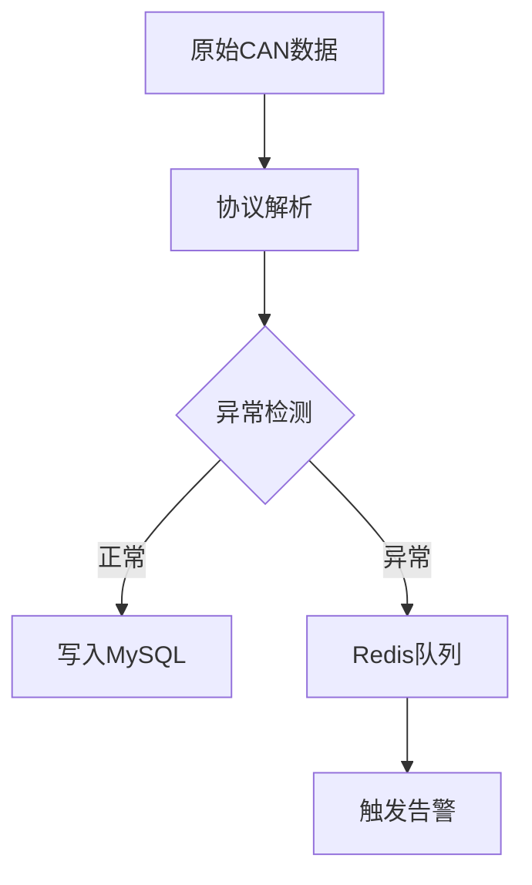

# AutoDataHub-monitor 智能驾驶数据监控系统

## 技术栈

| 组件       | 版本       | 用途                  |
|------------|------------|----------------------|
| Go         | 1.23.1     | 核心开发语言          |
| go-redis   | v8.11.5    | Redis数据队列管理     |
| GORM       | v1.25.12   | MySQL ORM框架         |
| Zap        | v1.27.0    | 结构化日志记录        |
| CAN协议解析| go.einride | v0.12.2              |

## 数据处理流程


## 项目结构
```
├── cmd/                 # 入口模块
│   ├── process/        # 数据处理入口
│   └── task/           # 定时任务入口
├── configs/            # 配置中心
│   ├── *.yaml          # 各车型信号配置
│   └── steering_angle.dbc  # CAN协议定义
├── internal/
│   ├── datasource/     # 数据源接入
│   ├── pipeline/       # 处理流水线
│   └── processor/      # 业务处理器
├── pkg/
│   ├── utils/          # CAN协议解析工具
│   └── models/         # 数据模型定义
```

## 配置示例
```yaml
# config.yaml
redis:
  addr: "localhost:6379"
  queue_name: "negative_triggers"

mysql:
  host: "localhost"
  database: "autodatahub"

vehicle_type:
  production_car_queue: "prod_triggers"
  test_drive_car_queue: "test_triggers"
```

## 快速开始
```bash
# 加载配置
make config 

# 启动数据处理
make run-process

# 执行定时任务
make run-task
```

## 协作规范

### 1. 分支管理
- `main` 分支为受保护分支，仅允许通过MR合并
- 功能开发使用 `feature/功能名称-日期` 格式分支
- 热修复使用 `hotfix/问题描述-日期` 格式分支

### 2. 提交规范
- 遵循 Conventional Commits 格式：
  `类型(作用域): 描述`
  示例：`feat(can): 新增CAN信号解析功能`
- 类型可选值：feat|fix|docs|style|refactor|test|chore

### 3. 代码审查
- 所有MR需要至少1个核心成员批准
- CI流程必须全部通过（单元测试/静态检查）

### 4. 开发准备
```bash
# 安装git hooks
ln -s ../../scripts/git-hooks/pre-commit .git/hooks/pre-commit
```