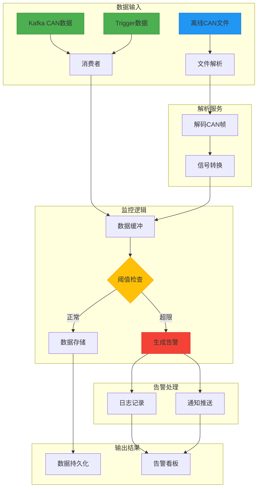

# 车辆状态监控系统工作流程

```mermaid
flowchart TD
    subgraph 数据输入
        A[Kafka CAN数据] --> C[消费者]
        B[Trigger数据] --> C
        D[离线CAN文件] --> E[文件解析]
    end

    subgraph 解析服务
        E --> F[解码CAN帧]
        F --> G[信号转换]
    end

    subgraph 监控逻辑
        C --> H[数据缓冲]
        G --> H
        H --> I{阈值检查}

        I -->|超限| J[生成告警]
        I -->|正常| K[数据存储]
    end

    subgraph 告警处理
        J --> L[日志记录]
        J --> M[通知推送]
    end

    subgraph 输出结果
        K --> N[数据持久化]
        L --> O[告警看板]
        M --> O
    end

    style A fill:#4CAF50,stroke:#388E3C
    style B fill:#4CAF50,stroke:#388E3C
    style D fill:#2196F3,stroke:#1976D2
    style I fill:#FFC107,stroke:#FFA000
    style J fill:#F44336,stroke:#D32F2F
```

## 流程说明
- **在线模式**：通过Kafka实时接收CAN数据和Trigger数据
- **离线模式**：直接解析本地CAN文件
- 红色节点表示告警触发路径
- 黄色菱形为阈值判断节点
- 蓝色节点为离线处理专用模块